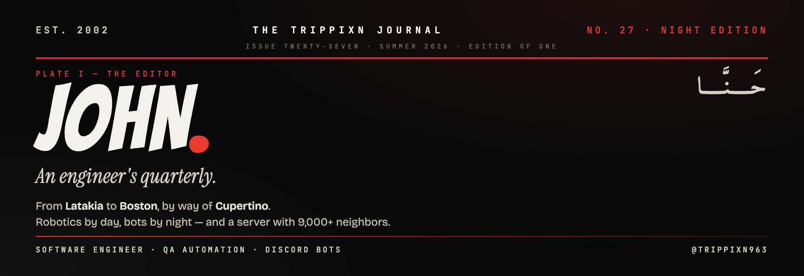
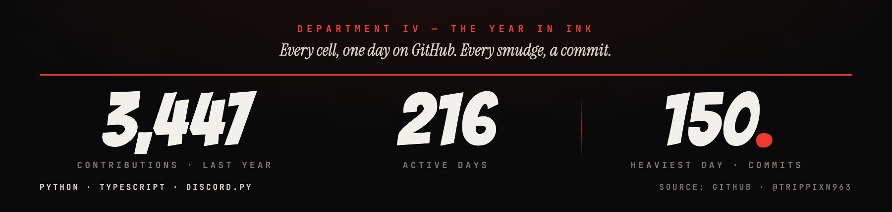

 

&nbsp;

&nbsp;

 

`— DEPARTMENT I · THE EDITOR`

### Hey, I'm John.

I build software that communities actually *live in*. Robotics and QA automation by day; Discord bots serving thousands by night. Born in **Latakia, Syria** — engineering my way from **Boston** toward **Cupertino**, one commit at a time.

Most nights you'll find me at the desk shipping features for **[discord.gg/syria](https://discord.gg/syria)** — a server with 9,000+ neighbors.

 

`— DEPARTMENT II · THE STACK`

 

`— DEPARTMENT III · FIELD WORK`

<table width="100%">
<tr>
<td width="50%" valign="top">

**`No. 01 — Discord Community Bot`**

### SyriaBot

The engine behind **discord.gg/syria** — moderation, leveling, an economy, automod, and a dozen live systems keeping 9,000+ members in order. Python, running 24/7.

[**› Read the source preview**](https://github.com/trippixn963/SyriaBot-Preview)

</td>
<td width="50%" valign="top">

**`No. 02 — Prayer & Devotion Bot`**

### TahaBot

Prayer times, Quran recitations, and the Hijri calendar for a Muslim community of **2,800+** — a single source of truth, delivered automatically every day.

*In production · source private*

</td>
</tr>
</table>

 

Live activity in the contribution graph below.

 

`— CORRESPONDENCE`

&nbsp;

  

THE TRIPPIXN JOURNAL · EDITION OF ONE · <em>less talk, more code.</em>

